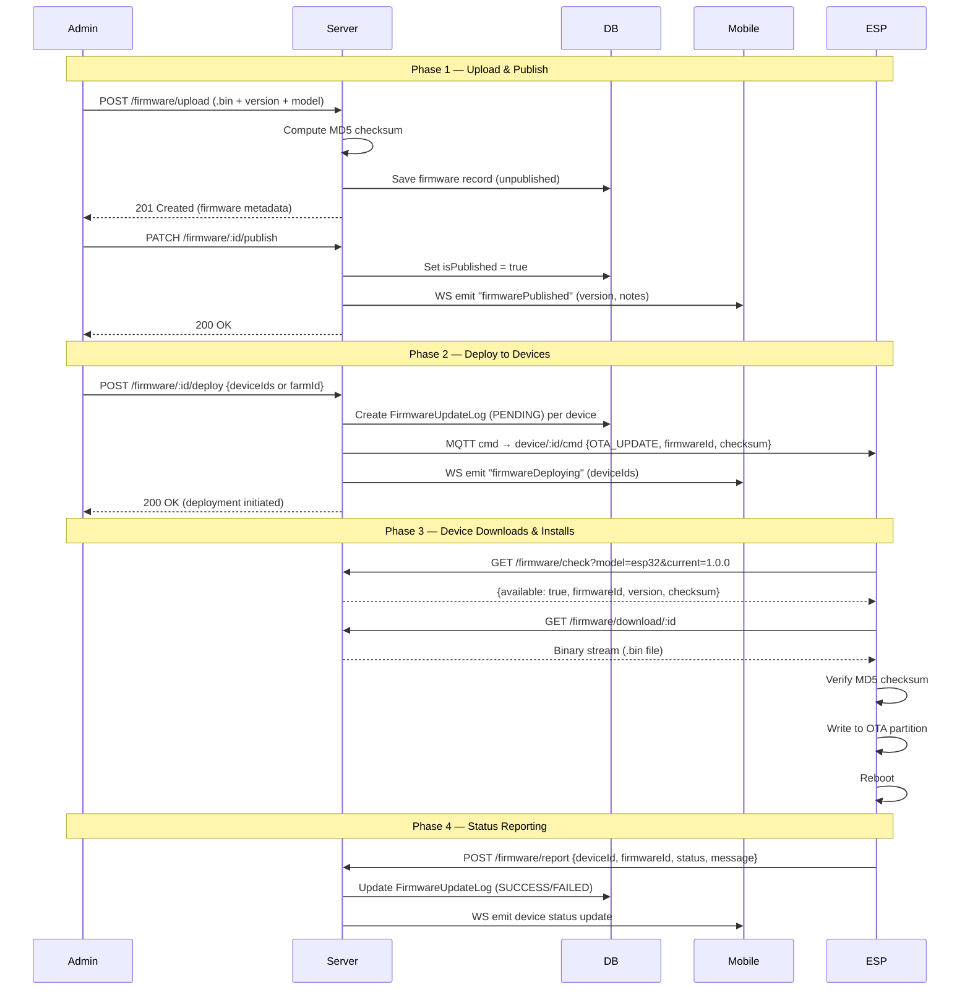
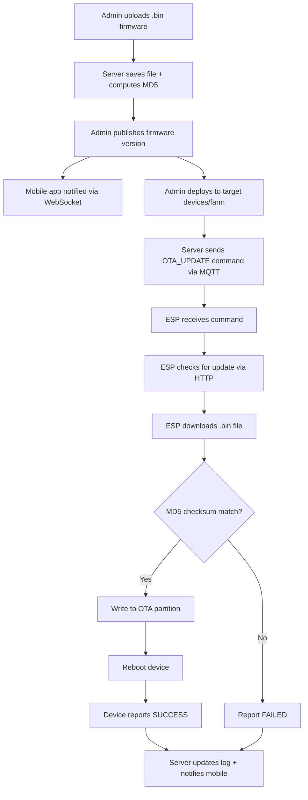
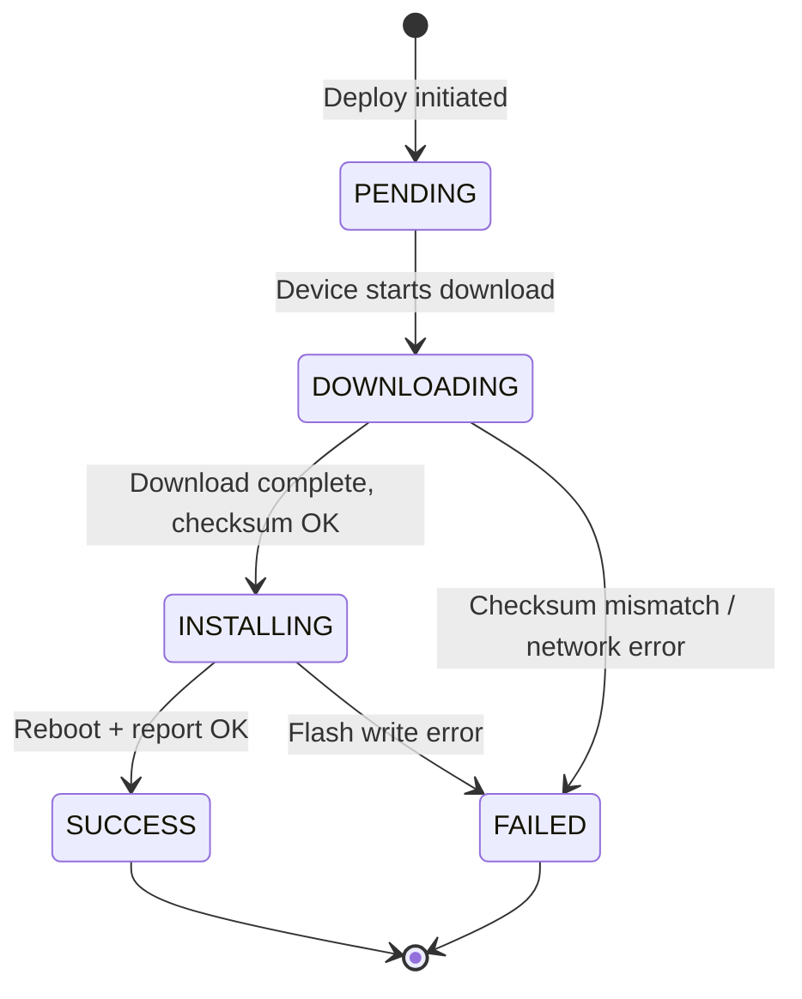

# ESP OTA Firmware Update Flow

## Overview

End-to-end flow for pushing firmware updates to ESP32 devices over-the-air via the QS Farm platform.

## Actors

| Actor | Transport | Role |
|-------|-----------|------|
| Admin | REST API | Uploads & publishes firmware, triggers deploy |
| Mobile App | WebSocket (Socket.IO) | Receives notifications, monitors progress |
| ESP Device | MQTT + HTTP | Receives commands, downloads binary, reports status |

## Flow Diagram

## Simplified Flowchart

## MQTT Topics Used

| Topic | Direction | Purpose |
|-------|-----------|---------|
| `device/{deviceId}/cmd` | Server → Device | Send OTA_UPDATE command |
| `device/{deviceId}/status` | Device → Server | Device status (updating/updated) |
| `device/{deviceId}/resp` | Device → Server | Command response/ack |

## HTTP Endpoints (No Auth — Device Use)

| Method | Path | Purpose |
|--------|------|---------|
| `GET` | `/firmware/check?model=X&currentVersion=Y` | Check if update available |
| `GET` | `/firmware/download/:id` | Download firmware binary |
| `POST` | `/firmware/report` | Report update result |

## REST Endpoints (Auth Required — Admin)

| Method | Path | Purpose |
|--------|------|---------|
| `POST` | `/firmware/upload` | Upload new firmware .bin |
| `GET` | `/firmware` | List all firmware versions |
| `PATCH` | `/firmware/:id/publish` | Mark firmware as published |
| `POST` | `/firmware/:id/deploy` | Push update to devices/farm |

## Update Status Lifecycle

