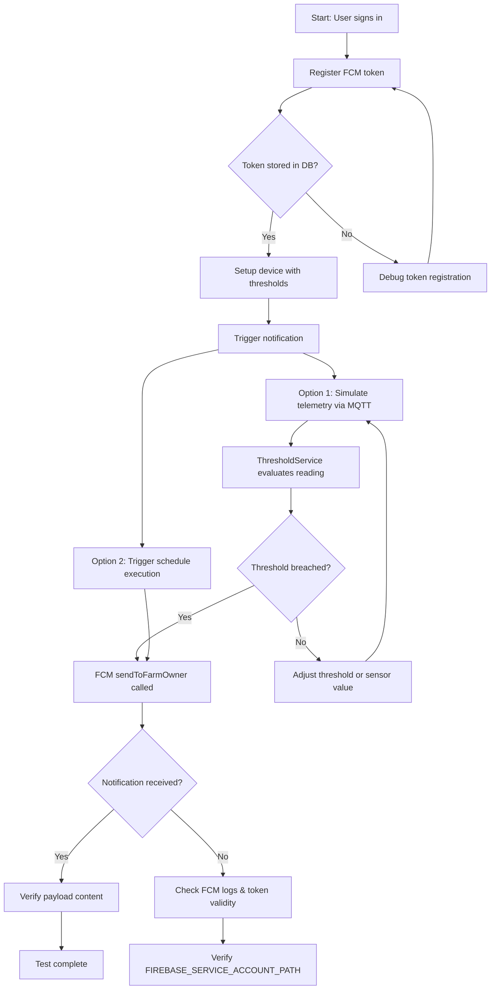

# FCM Notification Test Flow

## Overview

Step-by-step flow for testing Firebase Cloud Messaging push notifications end-to-end.

## Flow Diagram



## Prerequisites

- Firebase project with Cloud Messaging enabled
- Service account JSON file downloaded from Firebase Console
- `FIREBASE_SERVICE_ACCOUNT_PATH` set in `.env`
- A paired device with sensor configs + thresholds
- Mobile app with FCM SDK receiving push notifications

## Step 1: Authenticate

```bash
# Sign in to get JWT access token
curl -X POST http://localhost:3000/api/auth/sign-in \
  -H "Content-Type: application/json" \
  -d '{"email": "your@email.com", "password": "yourpassword"}'

# Save the accessToken from response
export TOKEN="<accessToken>"
```

## Step 2: Register FCM Device Token

```bash
# Register the FCM token from your mobile app
curl -X POST http://localhost:3000/api/notification/register-token \
  -H "Authorization: Bearer $TOKEN" \
  -H "Content-Type: application/json" \
  -d '{
    "token": "<fcm-token-from-mobile-app>",
    "platform": "ANDROID"
  }'
```

**Verify in DB:**
```sql
SELECT * FROM device_token WHERE "userId" = '<your-user-id>';
```

## Step 3: Ensure Device Has Thresholds

```sql
-- Check existing thresholds for your device
SELECT sc.id, sc."sensorType", st.level, st."minValue", st."maxValue", st.action
FROM sensor_config sc
JOIN sensor_threshold st ON st."sensorConfigId" = sc.id
WHERE sc."deviceId" = '<your-device-id>';
```

If no thresholds exist, create them:

```bash
# Create sensor config
curl -X POST http://localhost:3000/api/sensor/config \
  -H "Authorization: Bearer $TOKEN" \
  -H "Content-Type: application/json" \
  -d '{
    "deviceId": "<device-id>",
    "sensorType": "temperature",
    "unit": "C"
  }'

# Create threshold (triggers when value > 40)
curl -X POST http://localhost:3000/api/sensor/threshold \
  -H "Authorization: Bearer $TOKEN" \
  -H "Content-Type: application/json" \
  -d '{
    "sensorConfigId": "<sensor-config-id>",
    "level": "critical",
    "maxValue": 40,
    "action": "TURN_OFF_HEATER"
  }'
```

## Step 4: Trigger Notification (Option A - MQTT Telemetry)

Publish a telemetry reading that breaches the threshold:

```bash
# Using mosquitto_pub (or any MQTT client)
mosquitto_pub \
  -h localhost -p 1883 \
  -u "<mqtt-username>" -P "<mqtt-password>" \
  -t "device/<device-id>/telemetry" \
  -m '{"temperature": 45.5}'
```

**Expected flow:**
1. SyncService receives MQTT message
2. Emits `telemetry.received` event
3. SensorService stores reading + evaluates thresholds
4. ThresholdService detects `temperature=45.5 > maxValue=40`
5. Creates AlertLog entry
6. Calls `fcmService.sendToFarmOwner()` with:
   - title: `"CRITICAL Alert: temperature"`
   - body: reason string
   - data: `{ type: "SENSOR_ALERT", deviceId, sensorType, level, alertLogId }`
7. Mobile app receives push notification

## Step 4: Trigger Notification (Option B - Direct API Test)

If you want to test FCM in isolation without the full pipeline, add a temporary test endpoint:

```typescript
// Temporary: add to notification.controller.ts for testing
@Post('test-send')
async testSend(@CurrentUser() user: any) {
  // Find a farm owned by this user
  const farm = await this.farmRepo.findOne({ where: { userId: user.id } });
  await this.fcmService.sendToFarmOwner(farm.id, {
    title: 'Test Notification',
    body: 'This is a test push notification from QS Farm',
    data: { type: 'TEST', timestamp: new Date().toISOString() },
  });
  return { message: 'Test notification sent' };
}
```

## Step 5: Verify

### Check server logs

Look for these log lines:
```
[FcmService] FCM sent: 1 ok, 0 failed       # Success
[FcmService] Removed N stale FCM tokens       # Token cleanup (if tokens expired)
[FcmService] FCM send failed: <error>          # Error case
```

### Check database

```sql
-- Verify alert was logged
SELECT * FROM alert_log
WHERE "deviceId" = '<device-id>'
ORDER BY "createdAt" DESC LIMIT 5;

-- Verify command was dispatched (if threshold has action)
SELECT * FROM command_log
WHERE "deviceId" = '<device-id>'
ORDER BY "createdAt" DESC LIMIT 5;
```

### Check mobile app

- Notification should appear in system tray
- Tapping should contain correct data payload

## Troubleshooting

| Issue | Check |
|-------|-------|
| No notification received | Verify `FIREBASE_SERVICE_ACCOUNT_PATH` is set and file exists |
| `FCM disabled` in logs | Service account path env var missing |
| Token not registered error | FCM token expired, re-register from mobile app |
| Threshold not triggering | Check anti-spam cooldown (30s between same alerts) |
| `sendToFarmOwner` returns early | No device_token rows for farm owner's userId |
| Notification sent but not received | Check mobile app FCM setup (google-services.json, permissions) |

## Cleanup

```bash
# Unregister FCM token when done
curl -X DELETE http://localhost:3000/api/notification/unregister-token \
  -H "Authorization: Bearer $TOKEN" \
  -H "Content-Type: application/json" \
  -d '{
    "token": "<fcm-token>",
    "platform": "ANDROID"
  }'
```

## Anti-Spam Note

ThresholdService has a 30-second cooldown per device per action. If you send multiple telemetry readings quickly, only the first will trigger a notification. Wait 30s between tests or restart the server to reset the in-memory state.
