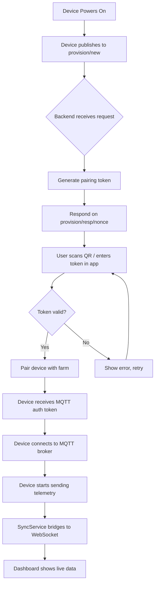

# Simple Device Onboarding Flow

## Overview

A basic flow for onboarding a new IoT device to the farm platform.

## Flow Diagram

## Steps

1. **Power On** - Device boots and connects to network
2. **Provision Request** - Device publishes to `provision/new` topic
3. **Token Generation** - Backend generates a 24h pairing token
4. **Pairing** - User enters token in mobile app with target farmId
5. **Authentication** - Device gets MQTT credentials
6. **Telemetry** - Device starts streaming sensor data
7. **Dashboard** - Real-time data visible on web/mobile

## Status Legend

| Status | Meaning |
|--------|---------|
| PENDING | Device registered, not yet paired |
| PAIRED | Token accepted, awaiting first connection |
| ACTIVE | Device online and sending data |
| DISABLED | Manually turned off by user |
